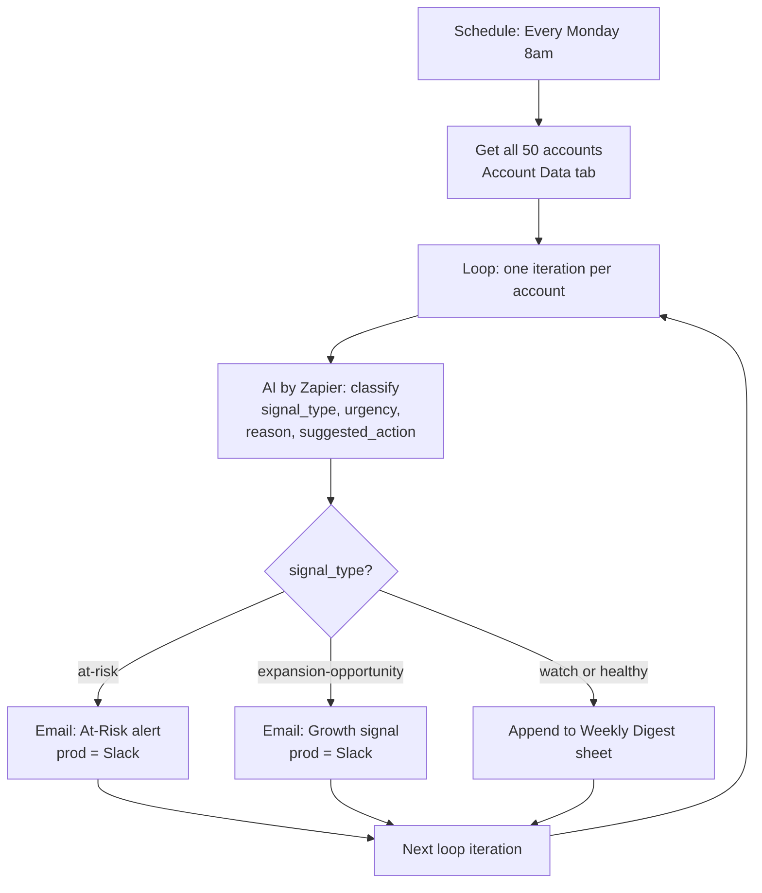

# Architecture

## The problem

A CS or support manager can't manually cross-reference Salesforce, a support tool, and product analytics for every account every week. By the time a pattern is visible, it's often already a renewal-week fire drill. And good-news signals — an account ready for an expansion conversation — get missed entirely because nobody's actively looking for upside.

This build automates the synthesis step. The AI isn't drafting a summary email. It's making the classification decision that determines whether a human sees this account at all this week, and if so, in which channel and with what framing.

## Flow

## Why this design

**Single master sheet instead of multiple lookup tabs:** eliminates the cascade of token failures that occur when lookup steps lose their references after edits. All 12 signals per account in one row means the loop passes everything directly to the AI with no intermediate lookups.

**Why not just dump everything into one Slack channel?** The point is reducing noise. Healthy accounts generate zero messages. Watch accounts go to a digest a manager can scan once a week.

**Why does the AI need explicit rules instead of "use your judgment"?** Consistency and auditability. The same inputs produce the same classification every run. When a CSM asks "why was my account flagged," the `reason` field plus the matching rule is a real answer.

**Why split expansion-opportunity from at-risk?** They go to different people with different framing and different urgency. A churn risk and a growth signal are different conversations. Conflating them either buries the opportunity under risk noise or makes risk alerts feel like sales pitches.

**Why 50 accounts?** Demonstrates the workflow scales beyond a handful of test records and produces a realistic spread of signal types — roughly 10 at-risk, 8 expansion-opportunity, and the rest watch or healthy.
